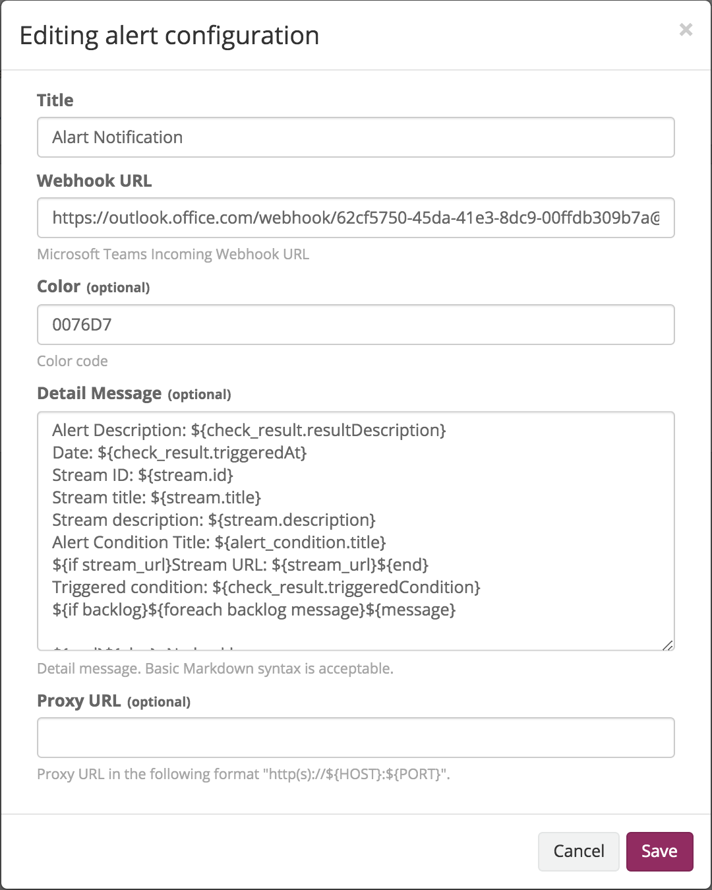
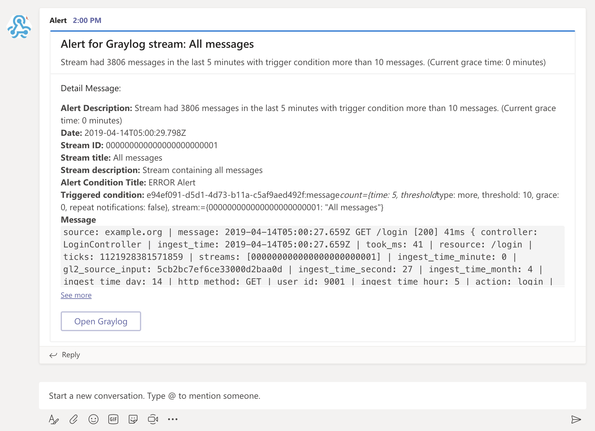

# Teams Plugin for Graylog

[](https://travis-ci.org/hidapple/graylog-plugin-teams.svg?branch=master)


A Graylog alarm callback plugin for sending [Microsoft Teams](https://products.office.com/en-us/microsoft-teams/group-chat-software)
MessageCard post.

**Required Graylog version:** 2.4.0 and later

Installation
------------

[Download the plugin](https://github.com/https://github.com/hidapple/graylog-plugin-teams.git/releases)
and place the `.jar` file in your Graylog plugin directory. The plugin directory
is the `plugins/` folder relative from your `graylog-server` directory by default
and can be configured in your `graylog.conf` file.

Restart `graylog-server` and you are done.

Usage
-----

#### 1. Publish Teams incoming webhook
First of all, you need to publish your Teams incoming webhook. See [Microsoft docs](https://docs.microsoft.com/en-us/microsoftteams/platform/concepts/connectors/connectors-using)
to know detail and how to publish your Teams incoming webhook.

#### 2. Create Graylog notification
Create Graylog notification of your stream and choose `Microsoft Teams Alarm Callback` as Notification type.

#### 3. Configure Microsoft Teams Alarm Callback
Input your Teams incoming webhook published at #1 and fill out other configurations. Here is a screenshot of configuration example.




#### 4. Receive notification
You will receive notification message.



Getting started
---------------

This project is using Maven 3 and requires Java 8 or higher.

* Clone this repository.
* Run `mvn package` to build a JAR file.
* Optional: Run `mvn jdeb:jdeb` and `mvn rpm:rpm` to create a DEB and RPM package respectively.
* Copy generated JAR file in target directory to your Graylog plugin directory.
* Restart the Graylog.

Plugin Release
--------------

We are using the maven release plugin:

```
$ mvn release:prepare
[...]
$ mvn release:perform
```

This sets the version numbers, creates a tag and pushes to GitHub. Travis CI will build the release artifacts and upload to GitHub automatically.

License
-------
See [LICENSE](https://github.com/hidapple/graylog-plugin-teams/blob/master/LICENSE)
